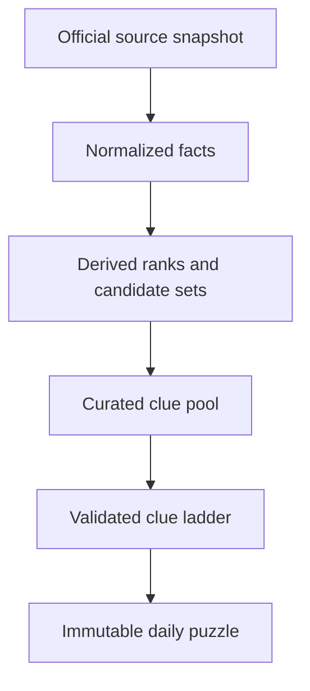

# GeoTrail — Clue Ladder Data Specification

**Status:** Proposed implementation contract<br>
**Scope:** U.S. state Clue Ladder only; 50 states, excluding the District of Columbia and territories<br>
**Prepared:** 2026-08-30<br>
**Product basis:** `GeoTrail_PLAN.md`, especially sections 2B, 7–9, 11, 16, and 17

## 1. Executive decision

GeoTrail should use a **fact-first, clue-second** database.

A clue must never be the only place where a factual claim exists. Official source snapshots are registered first; normalized facts are then derived from them; human-readable clues point to those facts through machine-readable predicates; and published daily puzzles freeze the exact clue and data versions that players saw.



This architecture provides five safeguards:

1. Source revisions do not silently rewrite an old daily puzzle.
2. Ranks are calculated from one complete, defined 50-state universe rather than copied from prose.
3. Every clue can be tested against all 50 states to measure how many candidates it leaves.
4. Different clues derived from the same underlying fact can be kept out of the same ladder.
5. Ambiguous terms such as “city,” “border,” “national park,” “area,” and “economy” have explicit definitions.

No clue should be generated by AI at runtime. AI may help draft candidates during research, but every released clue must be source-backed, compiled, reviewed, and versioned.

## 2. Core product decisions

### 2.1 Game universe

- The ranking universe is the **50 states only**.
- Washington, D.C., Puerto Rico, and other territories are excluded from state ranks and clue candidate counts.
- A clue must declare another universe explicitly if it uses one, such as “incorporated places within Alabama.”
- State identifiers use ISO-style IDs (`US-AL`) plus Census FIPS (`01`) and USPS postal codes (`AL`).

### 2.2 Data snapshots

- Each source release is immutable once ingested.
- “Most recent” is a collection decision, never clue wording.
- Every time-sensitive clue displays its reference year or exact date.
- New daily puzzles use the active snapshot. Old puzzle manifests retain their original snapshot.
- Ranks and ranges are recomputed whenever a source vintage changes; they are never hand-entered.

### 2.3 Definitions that must not be collapsed

| Topic | Keep separate |
|---|---|
| Area | land area, water area, and total area |
| Economy | current-dollar GDP, real GDP, GDP per capita, growth rate, and industry contribution |
| Population | decennial count, annual resident estimate, and ACS survey estimate |
| Cities | incorporated place, census-designated place, consolidated city balance, and metropolitan area |
| Parks | all NPS-associated units and units formally designated **National Park** |
| Borders | shared boundary segment, river boundary, water-only boundary, and point contact |
| Time | standard time zone, daylight-saving observance, and local exceptions |
| Transportation | infrastructure inventory, service, traffic/use, and historical importance |

When two official pages appear to disagree, the first question should be whether they are measuring different things. For example, an NPS state page may use “national parks” as a collective label for all NPS units, while the NPS system list separately identifies the 63 units formally designated National Park. Both records can be stored, but they must use different metric IDs and different clue wording.

## 3. Final repository structure

```text
data/clue-ladder/
├── schema/
│   ├── source.schema.json
│   ├── metric.schema.json
│   ├── fact.schema.json
│   ├── boundary.schema.json
│   ├── asset.schema.json
│   ├── clue.schema.json
│   └── puzzle-manifest.schema.json
├── catalog/
│   ├── sources.json
│   ├── metrics.json
│   └── snapshots.json
├── stable/
│   ├── states.json
│   ├── boundaries.json
│   └── assets.json
├── snapshots/
│   └── us-states-2026-08-30-v1/
│       ├── population.json
│       ├── places.json
│       ├── area.json
│       ├── economy.json
│       ├── parks.json
│       ├── time-zones.json
│       ├── physical-geography.json
│       ├── transportation.json
│       └── history.json
├── clues/
│   ├── US-AL.json
│   ├── US-CO.json
│   ├── US-RI.json
│   └── ...
├── ladders/
│   ├── assembly-rules.json
│   └── manifests/
└── review/
    ├── rejected-clues.json
    └── review-log.json
```

Stable identity records and geometry are separated from periodically revised statistical snapshots. The source registry is shared by both.

## 4. Canonical schema

The following is a logical data contract. Codex can translate it into JSON Schema and TypeScript without changing field meaning.

### 4.1 State identity

```ts
type StateId = `US-${string}`;
type SourceId = string;
type FactId = string;
type ClueId = string;
type AssetId = string;

type StateRecord = {
  stateId: StateId;                 // "US-AL"
  name: string;                     // "Alabama"
  slug: string;                     // "alabama"
  postalCode: string;               // "AL"
  censusFips: string;               // "01"
  censusRegion: string;             // "South"
  censusDivision: string;           // "East South Central"
  mapAssetId: AssetId;
  identitySourceRefs: SourceLocator[];
};
```

`StateRecord` contains only identity and routing fields. Capital, population, area, and similar claims remain facts so they can retain definitions and provenance.

### 4.2 Source registry

```ts
type SourceRecord = {
  sourceId: SourceId;
  publisher: string;
  title: string;
  landingPageUrl: string;
  downloadUrl?: string;
  datasetId?: string;               // e.g. "NST-EST2025-POP"
  tableId?: string;                 // e.g. "SAGDP1"
  editionOrVintage?: string;        // e.g. "Vintage 2025"
  releaseDate?: string;             // ISO date
  retrievedAt: string;              // ISO timestamp
  coverage: {
    referenceDate?: string;
    startDate?: string;
    endDate?: string;
    boundaryDate?: string;
  };
  authorityTier: 1 | 2 | 3;
  updateClass: "static" | "annual" | "quarterly" | "regulatory" | "event_driven";
  mimeType?: string;
  sha256?: string;                  // required for downloaded source files
  notes?: string;
};

type SourceLocator = {
  sourceId: SourceId;
  sheet?: string;
  table?: string;
  rowKey?: string;
  column?: string;
  variableCode?: string;
  page?: number;
  section?: string;
  featureId?: string;
};
```

A landing page alone is insufficient when the actual claim came from a spreadsheet row or GIS feature. The locator records the specific evidence.

### 4.3 Metric dictionary

```ts
type MetricDefinition = {
  metricId: string;                 // "population.resident_estimate"
  label: string;
  definition: string;
  valueType: "number" | "string" | "boolean" | "date" | "id_list" | "object";
  unit?: string;
  defaultUniverse?: string;
  preferredPublisher: string;
  timeSensitive: boolean;
  rankable: boolean;
  rankDirection?: "ascending" | "descending";
  allowedClueCategories: ClueCategory[];
  wordingRequirements?: string[];
};
```

Initial controlled metric IDs should include:

```text
identity.capital
identity.postal_code
history.admission_date
history.admission_order
population.resident_estimate
population.state_rank
place.population_estimate
place.within_state_rank
area.land_sq_mi
area.water_sq_mi
area.total_sq_mi
area.land_rank
economy.gdp_current_usd
economy.gdp_real_chained_usd
economy.gdp_state_rank
economy.industry_value_added_current_usd
economy.industry_share_of_gdp
nps.formal_national_park_count
nps.associated_unit
physical.highest_point
climate.annual_precipitation_average
time.standard_zone
transport.rail_line_miles
transport.interstate_miles
```

### 4.4 Facts and derived facts

```ts
type FactValue = number | string | boolean | string[] | Record<string, unknown>;

type FactRecord = {
  factId: FactId;
  subjectId: StateId | string;      // state, place, park, or other entity ID
  metricId: string;
  value: FactValue;
  unit?: string;
  referencePeriod: {
    kind: "static" | "point_date" | "calendar_year" | "range" | "legal_effective";
    date?: string;
    year?: number;
    startDate?: string;
    endDate?: string;
  };
  universe?: string;
  sourceRefs: SourceLocator[];
  derivation?: {
    method:
      | "rank"
      | "ratio"
      | "range_bucket"
      | "count"
      | "spatial_relation"
      | "manual_transcription";
    inputFactIds: FactId[];
    parameters: Record<string, unknown>;
    codeVersion: string;
  };
  snapshotId: string;
  quality: {
    status: "draft" | "verified" | "rejected" | "superseded";
    verifiedAt?: string;
    verificationMethod?: "second_reviewer" | "automated_crosscheck" | "both";
    notes?: string;
  };
};
```

Rules:

- Every non-derived fact has at least one source locator.
- Every derived fact has its input fact IDs and reproducible method.
- A rank is a derived fact. The source provides values; GeoTrail performs the rank within the declared universe.
- A ratio such as manufacturing share of GDP stores both numerator and denominator input facts.
- A revised release creates new fact records under a new snapshot; it does not mutate the prior snapshot.

### 4.5 Boundary relationships

```ts
type BoundaryRecord = {
  boundaryId: string;
  stateA: StateId;
  stateB: StateId;
  topology: "segment" | "point_contact";
  medium: "land" | "river" | "lake_or_coastal_water";
  clueBorderEligible: boolean;
  borderHuntEdge: boolean;
  sourceGeometryId: SourceId;
  derivation: {
    method: "spatial_intersection";
    toleranceMeters: number;
    codeVersion: string;
  };
  reviewerNotes?: string;
};
```

Recommended policy:

- Shared land and river **segments** count as ordinary bordering states and Border Hunt edges.
- Water-only segments are stored and may be used only when the clue explicitly says “water boundary”; they are not default Border Hunt edges.
- Point contacts are stored but are not default borders or Border Hunt edges.
- Therefore Colorado–Arizona is a point contact, while Rhode Island–New York is a water-only boundary. Neither should be silently mixed into a land-border clue.

### 4.6 Park associations

```ts
type ParkAssociation = {
  associationId: string;
  stateId: StateId;
  npsUnitId: string;
  unitName: string;
  formalDesignation: string;
  isFormallyNationalPark: boolean;
  relationship: "inside" | "partly_inside" | "trail_crosses" | "administrative_association";
  sourceRefs: SourceLocator[];
  snapshotId: string;
};
```

Cross-state parks count once for every state they actually intersect. National trails should not be mixed with bounded park units unless the clue says “NPS-associated units.”

### 4.7 Visual assets

```ts
type AssetRecord = {
  assetId: AssetId;
  kind: "silhouette" | "locator_map";
  stateId: StateId;
  sourceGeometryId: SourceId;
  projection: string;
  simplificationTolerance: number;
  viewBox: string;
  filePath: string;
  sha256: string;
  generatedAt: string;
  transformVersion: string;
  accessibility: {
    preAnswerAlt: "Mystery state shape" | "Mystery state location";
    postAnswerAlt: string;
  };
};
```

Do not put the state name, postal abbreviation, or FIPS code in a player-accessible filename, SVG title, metadata field, or pre-answer alt text.

### 4.8 Clue record

```ts
type ClueCategory =
  | "population"
  | "area"
  | "cities"
  | "capital"
  | "borders"
  | "economy"
  | "industry"
  | "transportation"
  | "parks"
  | "physical_geography"
  | "climate"
  | "landmark"
  | "history"
  | "time_zone"
  | "abbreviation"
  | "silhouette"
  | "map_position";

type Predicate =
  | { metricId: string; op: "eq" | "lt" | "lte" | "gt" | "gte"; value: FactValue }
  | { metricId: string; op: "between"; minInclusive: number; maxExclusive: number }
  | { metricId: string; op: "contains_all"; values: string[] }
  | { all: Predicate[] }
  | { any: Predicate[] };

type ClueRecord = {
  clueId: ClueId;
  answerStateId: StateId;
  category: ClueCategory;
  render: {
    kind: "text" | "image" | "map";
    text?: { en: string };
    assetId?: AssetId;
  };
  factRefs: FactId[];
  predicate: Predicate;
  candidateSet: {
    snapshotId: string;
    stateIds: StateId[];
    count: number;
    computedAt: string;
    evaluatorVersion: string;
  };
  difficulty: {
    seedTier: 1 | 2 | 3 | 4 | 5;  // 1 giveaway; 5 very hard
    knowledgePrior: "iconic" | "general" | "specialized" | "obscure";
    directness: "indirect" | "named_association" | "one_to_one" | "direct_identifier";
    calibrationStatus: "editorial_seed" | "playtest_calibrated";
    standaloneSolveRate?: number;
    sampleSize?: number;
  };
  ladderPolicy: {
    earliestRung: number;
    latestRung: number;
    dependencyGroup: string;
    incompatibleClueIds?: ClueId[];
    requiresEarlierCategory?: ClueCategory;
  };
  freshness: {
    class: "static" | "annual" | "regulatory" | "event_driven";
    referenceLabelRequired: boolean;
    reviewBy?: string;
  };
  review: {
    status: "draft" | "approved" | "rejected" | "retired";
    evidenceChecked: boolean;
    wordingChecked: boolean;
    fairnessChecked: boolean;
    notes?: string;
  };
};
```

The predicate is essential. It lets the build system verify that the clue is true for its answer and determine the other states for which it would also be true.

### 4.9 Published puzzle manifest

```ts
type PuzzleManifest = {
  puzzleId: string;
  mode: "clue_ladder";
  date?: string;
  answerStateId: StateId;
  orderedClueIds: ClueId[];
  dataSnapshotId: string;
  clueSetVersion: string;
  scoring: {
    maxByRung: number[];            // [1000, 900, ... 100]
    wrongGuessPenalty: number;      // e.g. 50
  };
  seed?: string;
  generatedAt: string;
  validatorVersion: string;
};
```

Once published, a manifest is immutable.

## 5. Difficulty system

Difficulty is not the same thing as factual uniqueness. “Admitted in 1876” identifies only Colorado for someone who knows the date, but the fact itself is obscure. Conversely, “entirely in Eastern Time” is familiar but leaves many candidates. GeoTrail should store both dimensions.

### 5.1 Objective selectivity

For every clue, evaluate its predicate against the active 50-state snapshot.

| Individual candidate count | Ambiguity base |
|---:|---:|
| 21–50 | 5 |
| 11–20 | 4 |
| 5–10 | 3 |
| 2–4 | 2 |
| 1 | 1 |

Also calculate information gain for analysis:

\[
I = \log_2(50 / N)
\]

where \(N\) is the candidate count. Information gain is diagnostic, not the public difficulty label.

### 5.2 Editorial knowledge prior

Before playtest data exist, add a transparent editorial adjustment:

| Knowledge prior | Adjustment |
|---|---:|
| iconic | −1 |
| general | 0 |
| specialized | +1 |
| obscure | +2 |

The seed difficulty tier is `clamp(1, 5, ambiguity base + knowledge adjustment)`.

Direct identifiers—postal abbreviation, silhouette, and highlighted locator map—are always Tier 1 regardless of the formula. The editorial prior is game metadata, not a claim about a state, and must be labeled `editorial_seed`.

### 5.3 Tier meaning

| Tier | Label | Expected use |
|---:|---|---|
| 5 | Very hard | broad, indirect, or specialized; usually rungs 1–3 |
| 4 | Hard | useful deduction clue; usually rungs 1–5 |
| 3 | Medium | meaningfully narrows the field; usually rungs 3–7 |
| 2 | Easy | named place, exact relationship, or one-to-one fact; usually rungs 5–9 |
| 1 | Giveaway | direct identity or highly iconic mapping; rungs 7–10 only |

### 5.4 Empirical calibration

After launch, retain the seed fields but add:

- standalone solve rate when a clue is experimentally shown first;
- incremental solve lift when the clue is revealed after prior rungs;
- median response time;
- wrong-guess rate;
- sample size and player-experience cohort.

Do not replace the editorial tier until at least 200 eligible exposures. Use shrinkage toward the seed tier so a small sample cannot produce wild changes. Calibration updates affect future manifests only.

## 6. Ladder assembly rules

### 6.1 Pool target

Target **18–24 approved clues per state across at least 9 categories**. A state is publishable with a minimum of 14 approved clues across 8 categories, provided a valid 8–10 rung ladder can be assembled. If the pool is short, the state remains unpublished; categories are never filled with weak claims merely to meet a quota.

Each state pool should aim for:

- 4 or more Tier 4–5 clues;
- 4 or more Tier 3 clues;
- 4 or more Tier 1–2 clues;
- at least one visual direct clue;
- at least one non-statistical clue before the final three rungs.

### 6.2 Ordering windows

- Rungs 1–3: primarily Tier 4–5, indirect, no direct identifiers.
- Rungs 4–6: Tier 2–4; at most one uniquely identifying named place before rung 6.
- Rungs 7–8: Tier 1–3; capitals, city pairs, and exact border sets allowed.
- Rungs 9–10: choose two of abbreviation, silhouette, and locator map.
- Abbreviation cannot appear before rung 8.
- Silhouette and locator map cannot appear before rung 9 unless a special game variant says otherwise.

Randomize within these windows using the deterministic puzzle seed. The category order should vary, but the ladder should still trend from difficult to easy.

### 6.3 Cumulative fairness

The builder must compute the intersection of candidate sets after each rung. Recommended targets for the first four rungs are:

| After rung | Preferred remaining candidates |
|---:|---:|
| 1 | 8–30 |
| 2 | 3–15 |
| 3 | 2–8 |
| 4 | 1–5 |

These are soft targets, because a clue can be objectively unique yet obscure. The builder should flag—not automatically reject—an early intersection of one candidate. A reviewer decides whether the knowledge burden still makes it fair.

### 6.4 Redundancy and leakage

- Only one clue from a dependency group may appear in a ladder unless explicitly permitted.
- Population value and population rank from the same vintage share a dependency group.
- Land-area value and land-area rank share a dependency group.
- A city-list clue and a capital clue are incompatible when the capital is also the largest city, unless separated into the final two rungs.
- “Four national parks” and a list of all four parks are incompatible in one ladder.
- A clue must not contain the answer name, demonym, postal code, obvious nickname, or player-visible asset metadata unless it is intentionally a direct clue.
- Do not repeat categories in the first eight rungs unless no diverse valid ladder exists.

## 7. Source hierarchy

### 7.1 Authority tiers

1. **Tier 1 — producing federal authority:** the agency that creates or legally defines the measure.
2. **Tier 2 — official state, tribal, or local authority:** used for state-specific facts the federal government does not maintain.
3. **Tier 3 — authoritative institution or scholarly reference:** allowed only when no Tier 1 or Tier 2 source exists, with a second independent verification and a reviewer note.

Wikipedia, tourism pages, commercial rankings, unsourced trivia collections, and generative-AI output may help discover a lead but cannot be the final evidence for an approved clue.

### 7.2 Category routing

| Category | Preferred source | Dataset/definition | Refresh policy |
|---|---|---|---|
| State population | U.S. Census Bureau | Population Estimates Program, newest completed vintage | Annual |
| Population rank | Derived by GeoTrail | Sort all 50 state values from one Census vintage | Annual |
| Major places | U.S. Census Bureau | City and Town Population Estimates; preserve place type | Annual |
| Land/total area | U.S. Census Bureau | MAF/TIGER area measurements; state whether land or total | On boundary-method revision |
| Boundaries/silhouette | U.S. Census Bureau | TIGER/Line legal boundaries; cartographic files for display | Annual geometry check |
| Capital/statehood | Census geography guide, National Archives, or official state record | Exact date/name | Event-driven/manual |
| Postal abbreviation | USPS | Publication 28, Appendix B | Manual/event-driven |
| GDP and industries | Bureau of Economic Analysis | SAGDP1 and SAGDP2; state current-dollar vs real | Annual after annual update |
| Employment industries | Bureau of Labor Statistics | QCEW, when an employment measure is desired | Annual |
| Formal national parks | National Park Service | National Park System designation list | Monthly/event-driven |
| Other NPS units | National Park Service | NPS system and state pages, with designation | Monthly/event-driven |
| Elevation/physical features | USGS, GNIS, 3DEP; NOAA NGS where appropriate | Preserve datum/method caveats | Manual/event-driven |
| Climate | NOAA/NCEI | 1991–2020 Climate Normals or named State Climate Summary | Decadal or report release |
| Standard time zones | U.S. DOT and current 49 CFR Part 71 | Regulatory boundary | Regulatory check |
| Rail | FRA/BTS | NTAD/North American Rail Network, versioned GIS | Each NTAD release |
| Highways | FHWA | Highway Statistics series, named table/year | Annual |
| Transit | FTA | National Transit Database, named reporter/year | Annual |
| Aviation | FAA/BTS | Airport or traffic dataset, named year | Annual |
| Historical landmarks | NPS NHL/NRHP, National Archives, managing federal/state agency | Exact designation or event | Event-driven |

### 7.3 Source-selection rules

- Use the producer's table or dataset, not a press summary, for numeric facts.
- Use one complete vintage for a comparison. Census explicitly warns that different population-estimate vintages should not be combined.
- Current Census Population Estimates releases may appear in downloadable spreadsheets before the current vintage is available through the Census API; the ingest plan must support XLSX/CSV source files.
- Preserve table IDs, variable/line codes, units, and footnotes.
- Downloaded source files receive a SHA-256 hash.
- If a source suppresses a value, store `null` plus its suppression code. Do not impute a clue value.
- A negative clue such as “has no formally designated National Park” is allowed only from a complete nationwide enumeration.

## 8. Rules for turning facts into fair clues

### 8.1 Numerical facts

- Store the exact official value; render a fair range when an exact value would be excessively revealing.
- Use fixed, documented interval rules or explicitly store the chosen bounds.
- Use half-open intervals (`minInclusive`, `maxExclusive`) to prevent overlaps.
- Include the year in the displayed clue: “Its July 1, 2025 population estimate was between 5.0 and 6.0 million.”
- State the dollar basis: current dollars, chained dollars, or per capita.
- A rank clue must say what is ranked, the universe, and the reference period.
- Do not use “latest,” “top economy,” “wealthiest,” “best,” or similar labels without a defined numerical metric.

### 8.2 Cities and places

- Never use “largest city” without defining the geography and year.
- Preferred wording: “largest incorporated place by July 1, 2025 resident population estimate.”
- Store Census legal/statistical area description (city, town, village, CDP, consolidated balance, municipality).
- Hawaii and other special cases may require Census-designated places rather than incorporated places. The wording must change with the universe; do not pretend the categories are identical.
- Do not mix city-proper and metropolitan-area populations in one clue or ranking.

### 8.3 Economy and industry

- GDP rank defaults to annual **current-dollar GDP** unless the clue explicitly says real GDP or per capita.
- Industry clues should use BEA value added or BLS employment, not “known for.”
- Example: “Manufacturing accounted for 14%–16% of 2025 current-dollar GDP.”
- Store both the numerator and denominator fact IDs for a derived share.
- Avoid quarterly annualized changes in ordinary Clue Ladder; they are volatile and hard to explain in a short clue.

### 8.4 Parks, landmarks, and history

- Preserve the formal NPS designation.
- “National Park” means a unit in the NPS list under that formal designation, not every NPS-managed or NPS-associated site.
- A multi-state park or trail must record its relationship to each state.
- Avoid broad historical “firsts” unless the scope, date, and authority are explicit.
- Avoid folklore, disputed nicknames, and causal claims that cannot fit accurately in one sentence.

### 8.5 Physical geography and climate

- Elevation clues must preserve the source and any datum/method limitation; ranges are safer than false precision.
- Climate clues must identify the averaging period or report vintage. Weather records for one month are generally unsuitable for a stable clue pool.
- “One of the rainiest states” is rejected unless converted to a specific measure and candidate predicate.
- Coastline length is excluded from the initial pool because agencies use materially different shoreline definitions. It can be added only with a definition-specific metric.

### 8.6 Borders and maps

- Clue text says “land/shared boundary,” “water boundary,” or “point contact” as appropriate.
- Exact named-border sets belong in later rungs.
- Border lists are derived from versioned geometry and manually reviewed for special cases.
- Silhouettes use one projection and one simplification policy across all 50 states.
- Alaska and Hawaii require separate locator-map handling; silhouettes must not be rescaled in a way that implies comparable geographic area.

### 8.7 Transportation

- Replace vague statements such as “famous railway hub” with a defined measure or official named facility.
- Valid patterns include miles of FRA rail network in a named NTAD release, Interstate mileage from a named FHWA Highway Statistics table, presence on a named federal rail corridor, or station ridership from a named year.
- Infrastructure presence and usage are different metrics and should not be conflated.
- If no distinctive, well-defined fact exists, leave the category empty for that state.

### 8.8 Wording and accessibility

- Prefer one factual proposition per clue.
- Use plain language under approximately 25 words when possible.
- Spell out unfamiliar statistical terms or avoid them.
- Never require color alone to interpret a map clue.
- Pre-answer alt text must describe the asset generically without revealing the answer.
- Sources and reference years should be visible in a clue-information panel, even if the main clue stays short.

## 9. Quality gates and automated validation

The data build fails if any of the following is true:

1. The active universe does not contain exactly 50 unique state IDs, postal codes, and FIPS codes.
2. A time-sensitive fact lacks a reference period, source locator, or source release/retrieval record.
3. A derived rank cannot be reproduced from exactly 50 state values from one snapshot.
4. A clue predicate is false for its answer state.
5. The stored candidate list differs from a fresh predicate evaluation.
6. A boundary segment is not symmetric.
7. A point contact or water-only boundary is used as a default Border Hunt edge.
8. A clue uses “National Park” for an NPS unit with another formal designation.
9. A place clue omits its place universe or mixes place and metro values.
10. An approved clue contains forbidden vague terms without a defined metric.
11. A direct identifier is scheduled before its earliest allowed rung.
12. One ladder contains incompatible dependency groups or prohibited duplicate categories.
13. The answer leaks through visible asset names, titles, descriptions, or alt text.
14. A daily puzzle manifest refers to a mutable “current” dataset instead of a snapshot ID.

Manual review additionally checks historical nuance, respectful wording, landmark significance, and whether an objectively selective clue is still too obscure or frustrating.

## 10. Source registry used for the examples

| Source ID | Official source | Reference |
|---|---|---|
| `CEN-PEP-STATE-V2025` | U.S. Census Bureau | NST-EST2025-POP; July 1, 2025 estimates; released January 2026 |
| `CEN-PEP-PLACE-V2025` | U.S. Census Bureau | SUB-IP-EST2025-POP; July 1, 2025 incorporated-place estimates; released May 2026 |
| `CEN-AREA-2010` | U.S. Census Bureau | MAF/TIGER area measurements; boundaries as of January 1, 2010 |
| `CEN-TIGER-2025` | U.S. Census Bureau | 2025 TIGER/Line legal boundaries; boundaries as of January 1, 2025 |
| `CEN-GUIDE-2010` | U.S. Census Bureau | State and Local Census Geography guides |
| `BEA-SAGDP-2025` | Bureau of Economic Analysis | SAGDP1 and SAGDP2 annual series, 2025 current-dollar values |
| `NPS-SYSTEM-2026-07` | National Park Service | National Park System list, including formal National Parks (63) |
| `NPS-STATE-2026` | National Park Service | Current state park/unit pages |
| `USGS-ELEV` | U.S. Geological Survey | Highest and Lowest Elevations |
| `DOT-TIME-2026` | U.S. Department of Transportation / eCFR | Uniform Time and 49 CFR Part 71 |
| `USPS-PUB28-2024` | U.S. Postal Service | Publication 28, Appendix B |
| `NOAA-SCS-2022` | NOAA/NESDIS | State Climate Summaries 2022, record extended through 2020 |

Example state population and GDP ranks below were derived by sorting only the 50 states. D.C. and Puerto Rico were excluded.

## 11. Example state A — Alabama

### 11.1 Normalized profile

| Field | Value | Reference |
|---|---:|---|
| State ID / FIPS / postal | `US-AL` / `01` / `AL` | Census / USPS |
| Capital | Montgomery | Census geography guide |
| Admission | December 14, 1819; 22nd state | Census geography guide |
| 2025 population | 5,193,088; rank 24 | Census Vintage 2025 |
| Land area | 50,645 sq mi; rank 28 | Census 2010 area measurements |
| 2025 current-dollar GDP | $341.1542 billion; rank 26 | BEA SAGDP1 |
| Manufacturing, 2025 | $51.0865 billion; 14.97% of state GDP | BEA SAGDP2, derived share |
| Largest incorporated places, 2025 | Huntsville 233,627; Mobile 200,824; Birmingham 195,893; Montgomery 195,300 | Census SUB-IP-EST2025-POP-01 |
| Shared boundary segments | Florida, Georgia, Mississippi, Tennessee | Census/TIGER review |
| Standard time | Entirely Central | DOT / 49 CFR Part 71 |
| Formally designated National Parks | 0 | NPS formal designation list |
| Example NPS units | Birmingham Civil Rights National Monument; Little River Canyon National Preserve; Russell Cave National Monument; Selma to Montgomery National Historic Trail | NPS Alabama page |
| Highest point | Cheaha Mountain, 2,407 ft | USGS |
| Climate research fact | 55.4 in statewide average annual precipitation in the NOAA 2022 summary | NOAA State Climate Summary 2022 |

Important correction: Birmingham is not Alabama's largest incorporated place in the 2025 Census estimate. Huntsville is first, Mobile second, Birmingham third, and Montgomery fourth. A clue saying “Birmingham is the largest city” must be rejected as stale/incorrect.

### 11.2 Approved clue pool specimen

| Clue ID | Player-facing clue | Category | Candidates | Tier | Rung window |
|---|---|---|---:|---:|---|
| `al.park.formal-0` | No NPS unit in this state is formally designated a National Park. *(NPS snapshot: July 2026)* | parks | 19 | 5 | 1–3 |
| `al.industry.mfg-14-16` | Manufacturing accounted for 14%–16% of its 2025 current-dollar GDP. | industry | 7 | 4 | 1–5 |
| `al.gdp.300-400` | Its 2025 current-dollar GDP was between $300 billion and $400 billion. | economy | 7 | 4 | 1–5 |
| `al.population.5-6m` | Its July 1, 2025 population estimate was between 5.0 million and 6.0 million. | population | 4 | 3 | 2–6 |
| `al.area.rank-26-30` | It ranked 26th–30th in land area among the 50 states using Census 2010 measurements. | area | 5 | 4 | 2–6 |
| `al.highpoint.2000-2500` | Its highest point is between 2,000 and 2,500 feet above sea level. | physical geography | 3 | 3 | 3–7 |
| `al.history.1810s` | It joined the Union during the 1810s. | history | 5 | 4 | 2–6 |
| `al.time.central-all` | The entire state is in the Central standard time zone. | time zone | 10 | 3 | 4–7 |
| `al.landmark.selma-montgomery` | The Selma to Montgomery National Historic Trail is here. | landmark | 1 | 2 | 5–8 |
| `al.cities.top2-2025` | Huntsville and Mobile were its two largest incorporated places in the 2025 Census estimates. | cities | 1 | 2 | 6–8 |
| `al.capital.montgomery` | Its capital is Montgomery. | capital | 1 | 2 | 6–9 |
| `al.borders.segment-set` | It shares boundary segments with Florida, Georgia, Mississippi, and Tennessee. | borders | 1 | 2 | 6–9 |
| `al.postal` | Its postal abbreviation is **AL**. | abbreviation | 1 | 1 | 8–10 |
| `al.silhouette` | *Mystery state silhouette* | silhouette | 1 | 1 | 9–10 |
| `al.locator` | *Mystery state highlighted on an unlabeled U.S. map* | map position | 1 | 1 | 9–10 |

The climate fact is researched but should remain `draft` until the same metric has been ingested for all 50 states and its candidate set is computable. It is not used merely to fill a climate slot.

### 11.3 Valid sample ladder

The first four cumulative candidate counts are 19 → 5 → 2 → 1.

| Rung | Clue ID | Maximum score |
|---:|---|---:|
| 1 | `al.park.formal-0` | 1,000 |
| 2 | `al.industry.mfg-14-16` | 900 |
| 3 | `al.population.5-6m` | 800 |
| 4 | `al.gdp.300-400` | 700 |
| 5 | `al.highpoint.2000-2500` | 600 |
| 6 | `al.history.1810s` | 500 |
| 7 | `al.time.central-all` | 400 |
| 8 | `al.cities.top2-2025` | 300 |
| 9 | `al.postal` | 200 |
| 10 | `al.silhouette` | 100 |

## 12. Example state B — Colorado

### 12.1 Normalized profile

| Field | Value | Reference |
|---|---:|---|
| State ID / FIPS / postal | `US-CO` / `08` / `CO` | Census / USPS |
| Capital | Denver | Census geography guide |
| Admission | August 1, 1876; 38th state | Census geography guide |
| 2025 population | 6,012,561; rank 20 | Census Vintage 2025 |
| Land area | 103,642 sq mi; rank 8 | Census 2010 area measurements |
| 2025 current-dollar GDP | $584.3239 billion; rank 17 | BEA SAGDP1 |
| Professional, scientific, and technical services, 2025 | $66.0053 billion; 11.30% of state GDP | BEA SAGDP2, derived share |
| Largest incorporated places, 2025 | Denver 740,613; Colorado Springs 494,743; Aurora 410,053 | Census SUB-IP-EST2025-POP-08 |
| Shared boundary segments | Wyoming, Nebraska, Kansas, Oklahoma, New Mexico, Utah | TIGER topology |
| Point contact | Arizona at Four Corners; not a default Border Hunt edge | TIGER topology/manual review |
| Standard time | Entirely Mountain | DOT / 49 CFR Part 71 |
| Formally designated National Parks | 4: Black Canyon of the Gunnison, Great Sand Dunes, Mesa Verde, Rocky Mountain | NPS formal designation list |
| Highest point | Mount Elbert, 14,433 ft in the cited USGS table | USGS |
| Climate research fact | 18.0 in statewide average annual precipitation in the NOAA 2022 summary | NOAA State Climate Summary 2022 |

### 12.2 Approved clue pool specimen

| Clue ID | Player-facing clue | Category | Candidates | Tier | Rung window |
|---|---|---|---:|---:|---|
| `co.gdp.500-650` | Its 2025 current-dollar GDP was between $500 billion and $650 billion. | economy | 6 | 4 | 1–5 |
| `co.population.5_5-6_5m` | Its July 1, 2025 population estimate was between 5.5 million and 6.5 million. | population | 6 | 4 | 1–5 |
| `co.industry.pst-10-13` | Professional, scientific, and technical services contributed 10%–13% of its 2025 GDP. | industry | 3 | 3 | 2–6 |
| `co.area.rank-6-10` | It ranked 6th–10th in land area among the 50 states using Census 2010 measurements. | area | 5 | 4 | 2–6 |
| `co.highpoint.14000-15000` | Its highest point is between 14,000 and 15,000 feet above sea level. | physical geography | 3 | 2 | 3–7 |
| `co.history.1865-1880` | It was admitted to the Union between 1865 and 1880. | history | 2 | 3 | 3–7 |
| `co.time.mountain-all` | The entire state is in the Mountain standard time zone. | time zone | 6 | 3 | 4–7 |
| `co.parks.formal-4` | It contains four units formally designated National Park. *(NPS snapshot: July 2026)* | parks | 1 | 2 | 5–8 |
| `co.parks.named-pair` | Black Canyon of the Gunnison and Mesa Verde National Parks are here. | landmark | 1 | 2 | 5–8 |
| `co.cities.top2-2025` | Denver and Colorado Springs were its two largest incorporated places in the 2025 Census estimates. | cities | 1 | 2 | 6–8 |
| `co.capital.denver` | Its capital is Denver. | capital | 1 | 1 | 7–9 |
| `co.borders.segment-set` | It shares boundary segments with Wyoming, Nebraska, Kansas, Oklahoma, New Mexico, and Utah. | borders | 1 | 2 | 6–9 |
| `co.point.arizona` | It meets Arizona at a point but shares no boundary segment with it. | physical geography | 1 | 2 | 5–8 |
| `co.postal` | Its postal abbreviation is **CO**. | abbreviation | 1 | 1 | 8–10 |
| `co.silhouette` | *Mystery state silhouette* | silhouette | 1 | 1 | 9–10 |
| `co.locator` | *Mystery state highlighted on an unlabeled U.S. map* | map position | 1 | 1 | 9–10 |

`co.parks.formal-4` and `co.parks.named-pair` are incompatible in one ladder. `co.cities.top2-2025` and `co.capital.denver` are also incompatible before the final two rungs because Denver is both the capital and largest incorporated place.

### 12.3 Valid sample ladder

The first four cumulative candidate counts are 6 → 3 → 2 → 1.

| Rung | Clue ID | Maximum score |
|---:|---|---:|
| 1 | `co.gdp.500-650` | 1,000 |
| 2 | `co.population.5_5-6_5m` | 900 |
| 3 | `co.industry.pst-10-13` | 800 |
| 4 | `co.highpoint.14000-15000` | 700 |
| 5 | `co.history.1865-1880` | 600 |
| 6 | `co.parks.formal-4` | 500 |
| 7 | `co.time.mountain-all` | 400 |
| 8 | `co.borders.segment-set` | 300 |
| 9 | `co.silhouette` | 200 |
| 10 | `co.postal` | 100 |

This order deliberately differs from Alabama's. Another valid Colorado puzzle could replace the park-count clue with the city pair and end with locator map plus abbreviation.

## 13. Example state C — Rhode Island

### 13.1 Normalized profile

| Field | Value | Reference |
|---|---:|---|
| State ID / FIPS / postal | `US-RI` / `44` / `RI` | Census / USPS |
| Capital | Providence | Census geography guide |
| Admission | May 29, 1790; 13th state | Census geography guide |
| 2025 population | 1,114,521; rank 44 | Census Vintage 2025 |
| Land area | 1,033.8 sq mi; rank 50 | Census 2010 area measurements |
| 2025 current-dollar GDP | $83.9560 billion; rank 44 | BEA SAGDP1 |
| Educational services, health care, and social assistance, 2025 | $11.4077 billion; 13.59% of state GDP | BEA SAGDP2, derived share |
| Largest incorporated places, 2025 | Providence 195,310; Cranston 84,647; Warwick 84,187 | Census SUB-IP-EST2025-POP-44 |
| Shared land boundary segments | Connecticut, Massachusetts | TIGER topology |
| Water-only boundary | New York; not a default Border Hunt edge | Census/TIGER topology review |
| Standard time | Entirely Eastern | DOT / 49 CFR Part 71 |
| Formally designated National Parks | 0 | NPS formal designation list |
| Example NPS units | Blackstone River Valley National Historical Park; Roger Williams National Memorial; Touro Synagogue National Historic Site | NPS Rhode Island page |
| Highest point | Jerimoth Hill, 812 ft | USGS |
| Climate research fact | About 46 in statewide average annual precipitation in the NOAA 2022 summary | NOAA State Climate Summary 2022 |

### 13.2 Approved clue pool specimen

| Clue ID | Player-facing clue | Category | Candidates | Tier | Rung window |
|---|---|---|---:|---:|---|
| `ri.park.formal-0` | No NPS unit in this state is formally designated a National Park. *(NPS snapshot: July 2026)* | parks | 19 | 5 | 1–3 |
| `ri.highpoint.under-1000` | Its highest point is below 1,000 feet above sea level. | physical geography | 5 | 4 | 1–5 |
| `ri.population.1-1_5m` | Its July 1, 2025 population estimate was between 1.0 million and 1.5 million. | population | 6 | 4 | 1–5 |
| `ri.gdp.75-100` | Its 2025 current-dollar GDP was between $75 billion and $100 billion. | economy | 5 | 4 | 1–5 |
| `ri.area.rank-46-50` | It ranked 46th–50th in land area among the 50 states using Census 2010 measurements. | area | 5 | 3 | 2–6 |
| `ri.industry.edu-health-12-15` | Education, health care, and social assistance contributed 12%–15% of its 2025 GDP. | industry | 6 | 4 | 2–6 |
| `ri.history.13th` | It was the 13th state to join the Union under the current Constitution. | history | 1 | 3 | 3–7 |
| `ri.time.eastern-all` | The entire state is in the Eastern standard time zone. | time zone | 17 | 4 | 3–7 |
| `ri.landmark.touro-roger` | Touro Synagogue National Historic Site and Roger Williams National Memorial are here. | landmark | 1 | 2 | 5–8 |
| `ri.cities.top2-2025` | Providence and Cranston were its two largest incorporated places in the 2025 Census estimates. | cities | 1 | 2 | 6–8 |
| `ri.capital.providence` | Its capital is Providence. | capital | 1 | 1 | 7–9 |
| `ri.borders.typed` | It has land boundaries with Connecticut and Massachusetts and a water boundary with New York. | borders | 1 | 2 | 6–9 |
| `ri.postal` | Its postal abbreviation is **RI**. | abbreviation | 1 | 1 | 8–10 |
| `ri.silhouette` | *Mystery state silhouette* | silhouette | 1 | 1 | 9–10 |
| `ri.locator` | *Mystery state highlighted on an unlabeled U.S. map* | map position | 1 | 1 | 9–10 |

### 13.3 Valid sample ladder

The first four cumulative candidate counts are 19 → 4 → 2 → 1.

| Rung | Clue ID | Maximum score |
|---:|---|---:|
| 1 | `ri.park.formal-0` | 1,000 |
| 2 | `ri.highpoint.under-1000` | 900 |
| 3 | `ri.population.1-1_5m` | 800 |
| 4 | `ri.gdp.75-100` | 700 |
| 5 | `ri.industry.edu-health-12-15` | 600 |
| 6 | `ri.history.13th` | 500 |
| 7 | `ri.time.eastern-all` | 400 |
| 8 | `ri.borders.typed` | 300 |
| 9 | `ri.capital.providence` | 200 |
| 10 | `ri.locator` | 100 |

## 14. Rejected-clue examples

| Rejected wording | Reason | Acceptable replacement |
|---|---|---|
| “Ranks 46th in economy according to the latest survey.” | No metric, universe, source, or year | “Its 2025 current-dollar GDP ranked 44th among the 50 states using BEA SAGDP1.” |
| “Birmingham is the largest city.” | Stale and undefined; contradicted by 2025 incorporated-place estimates | “Huntsville and Mobile were its two largest incorporated places in the 2025 Census estimates.” |
| “Alabama has nine national parks.” | NPS state-page collective label is not formal designation count | “No NPS unit in Alabama is formally designated a National Park.” |
| “Colorado has a huge economy.” | Subjective and untestable | “Its 2025 current-dollar GDP was between $500 billion and $650 billion.” |
| “Rhode Island has a long coastline.” | “Long” is subjective; coastline measures use incompatible definitions | Omit until a definition-specific shoreline metric is selected. |
| “Birmingham is famous as a railroad hub.” | “Famous” and “hub” are undefined | Use a named FRA/BTS rail-network metric or omit the clue. |
| “This is one of the rainiest states.” | Vague ranking and unspecified climate period | Use a NOAA value with a named averaging period after all-state candidate calibration. |

## 15. All-50-state collection workflow

1. **Lock source vintages.** Register the national source files and their hashes before transcribing any state.
2. **Ingest nationwide values.** Rankings and candidate sets require all 50 values; do not research one state in isolation for rankable metrics.
3. **Normalize special cases.** Resolve place types, consolidated governments, multi-state parks, split time zones, water boundaries, and point contacts.
4. **Derive facts.** Compute ranks, ratios, range predicates, park counts, adjacency, and candidate sets reproducibly.
5. **Draft clue variants.** Create several ranges or phrasings from one fact, but put them in one dependency group.
6. **Review evidence and wording.** Every approved clue receives evidence, wording, and fairness checks.
7. **Assemble test ladders.** Generate many seeded ladders per state and enforce category, rung, and leakage constraints.
8. **Playtest.** Measure standalone and incremental clue performance; calibrate only after sufficient exposure.
9. **Publish an immutable snapshot.** Daily manifests refer to exact clue and data versions.
10. **Refresh deliberately.** New official vintages create a new snapshot and retire or regenerate affected clues.

## 16. Recommended implementation handoff to Codex

The next Codex task should be limited to the data layer, not the game UI:

1. Convert the logical contracts in section 4 into JSON Schemas and TypeScript types.
2. Create the controlled metric catalog and source registry.
3. Add the three example state fixtures from sections 11–13.
4. Implement validators for provenance, reference periods, ranks, candidate predicates, boundaries, clue incompatibilities, and direct-clue rung limits.
5. Add a deterministic ladder compiler that consumes only approved clue records.
6. Add tests for the cumulative candidate counts shown in the three sample ladders.
7. Produce a validation report; do not build Clue Ladder screens yet.

### Acceptance criteria

- All three example profiles validate against the schemas.
- Population and GDP ranks reproduce exactly from the full 50-state source tables.
- Alabama's 2025 largest incorporated place resolves to Huntsville.
- Colorado–Arizona is stored as point contact and excluded from the default border graph.
- Rhode Island–New York is stored as water-only and excluded from the default border graph.
- Formal National Park counts resolve to Alabama 0, Colorado 4, Rhode Island 0.
- No approved dynamic clue lacks a year/reference date and source locator.
- The three sample ladders compile with their stated early cumulative candidate counts.
- Updating a source snapshot cannot alter a previously published puzzle manifest.

## 17. Official source links

- [Census Vintage 2025 National and State Population Estimates](https://www.census.gov/newsroom/press-kits/2026/national-state-population-estimates.html)
- [Census City and Town Population Totals: 2020–2025](https://www.census.gov/data/tables/time-series/demo/popest/2020s-total-cities-and-towns.html)
- [Census State Area Measurements](https://www.census.gov/geographies/reference-files/2010/geo/state-area.html)
- [Census 2025 TIGER/Line Shapefiles](https://www.census.gov/geographies/mapping-files/time-series/geo/tiger-line-file.html)
- [Census Guide to State and Local Geography](https://www.census.gov/geographies/reference-files/2010/geo/state-local-geo-guides-2010.html)
- [BEA GDP by State](https://www.bea.gov/data/gdp/gdp-state)
- [BEA Regional Data Downloads](https://apps.bea.gov/regional/downloadzip.htm)
- [NPS National Park System and Formal Designation Lists](https://www.nps.gov/aboutus/national-park-system.htm)
- [NPS Alabama](https://www.nps.gov/state/al/index.htm)
- [NPS Colorado](https://www.nps.gov/state/co/index.htm)
- [NPS Rhode Island](https://www.nps.gov/state/ri/index.htm)
- [USGS Highest and Lowest Elevations](https://www.usgs.gov/educational-resources/highest-and-lowest-elevations)
- [NOAA/NCEI U.S. Climate Normals](https://www.ncei.noaa.gov/products/land-based-station/us-climate-normals)
- [NOAA State Climate Summaries 2022](https://www.ncei.noaa.gov/news/noaa-addresses-climate-each-state)
- [U.S. DOT Uniform Time](https://www.transportation.gov/regulations/time-act)
- [49 CFR Part 71 — Standard Time Zone Boundaries](https://www.ecfr.gov/current/title-49/subtitle-A/part-71?toc=1)
- [USPS Publication 28, Appendix B](https://pe.usps.com/text/pub28/28apb.htm)
- [FRA Maps and GIS / NTAD](https://railroads.dot.gov/rail-network-development/maps-and-data/maps-geographic-information-system/maps-geographic)
- [BTS National Transportation Atlas Database](https://www.bts.gov/ntad)
- [FHWA Highway Statistics 2024](https://www.fhwa.dot.gov/policyinformation/statistics/2024/)
